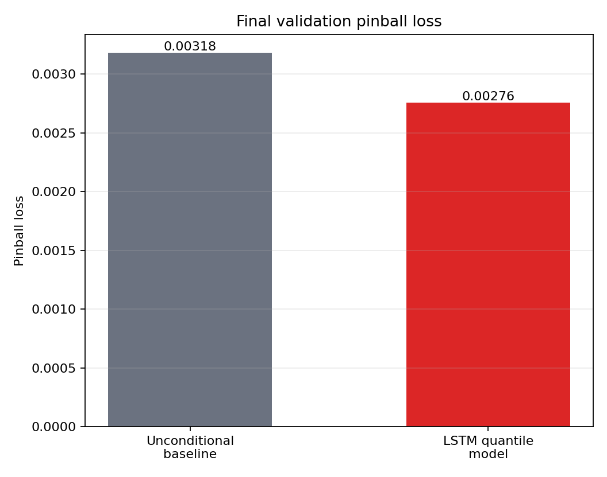
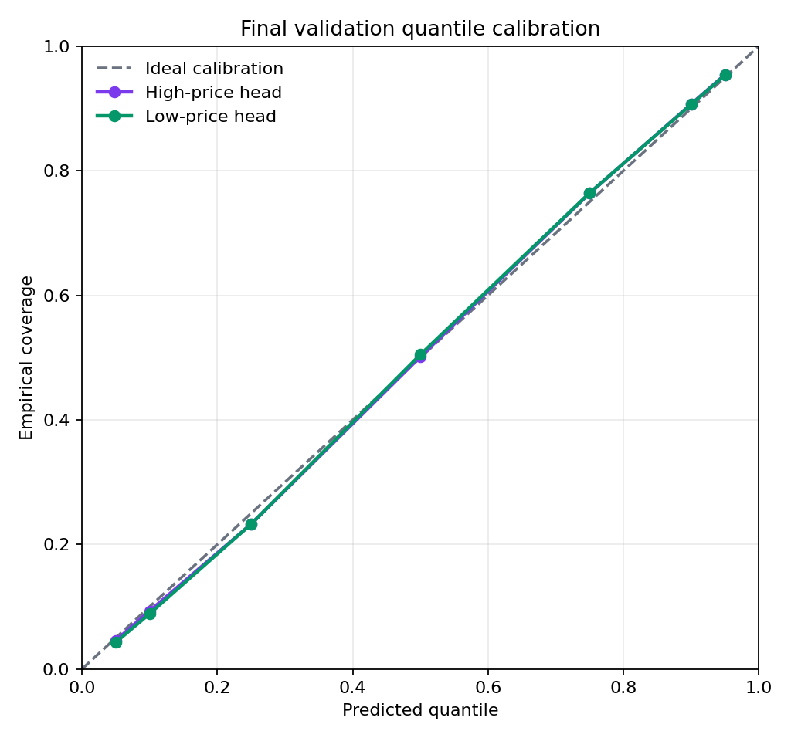
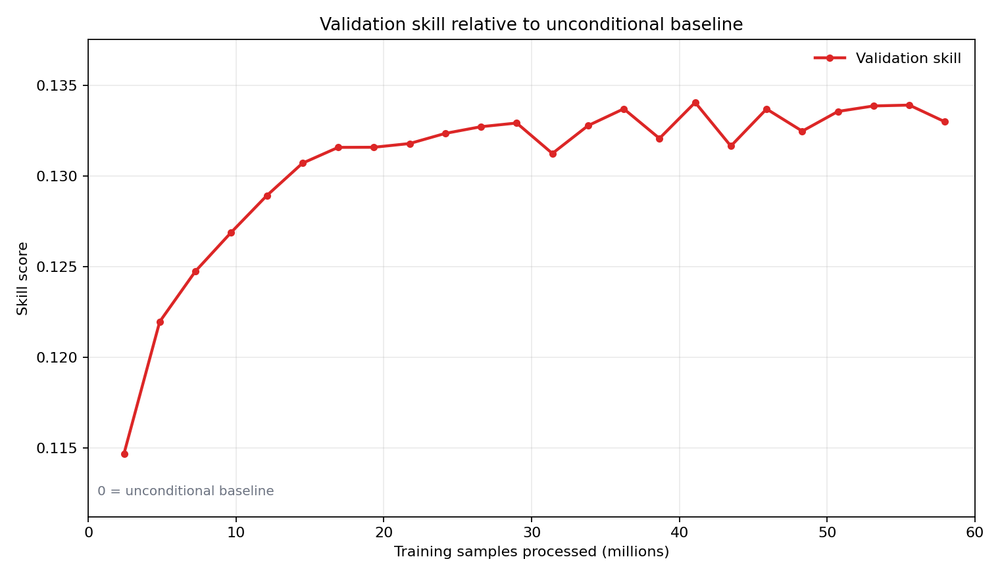
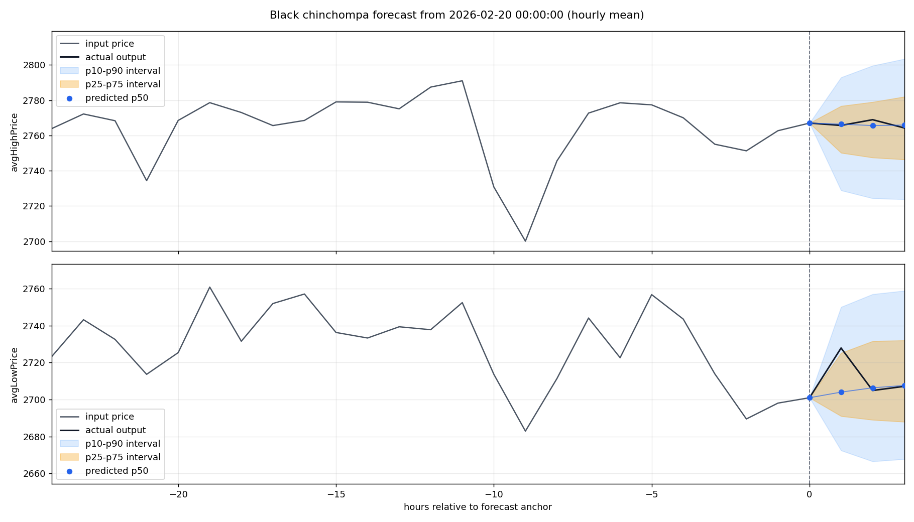
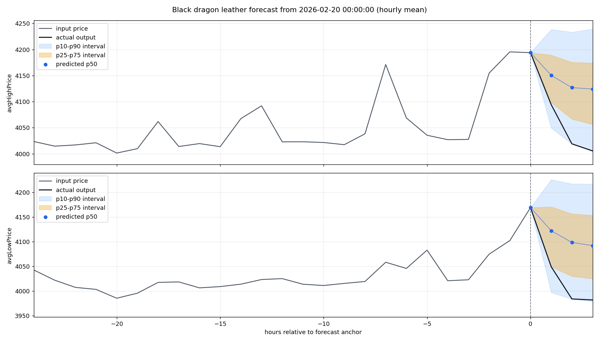
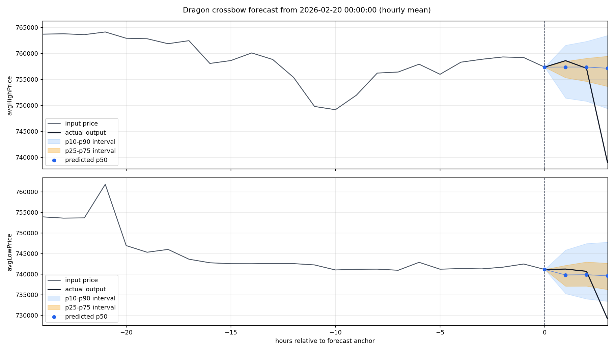

# Old School RuneScape Item Price Prediction

I built this project to forecast short-term Old School RuneScape Grand Exchange item price movements from historical price and volume data. The model is a PyTorch LSTM quantile regressor that produces probabilistic forecasts for both high and low traded prices across multiple future horizons.

My aim was to build a complete statistical data science workflow around a public, high-frequency market dataset: data collection, cleaning, feature engineering, leakage-aware train/validation/test splitting, probabilistic modelling, benchmark comparison, calibration analysis, and reproducible reporting.

## At a glance

| Area | Summary |
| --- | --- |
| Task | Probabilistic short-horizon forecasting for OSRS Grand Exchange item prices |
| Data | Public OSRS Wiki price API, transformed into regular 5-minute item time series |
| Model | Multi-horizon LSTM quantile regressor with separate high-price and low-price heads |
| Forecast horizons | 5 minutes to 6 hours ahead |
| Training run | 230 items, 48 engineered features, 19.3M training sequences |
| Validation result | 13.34% skill improvement over an unconditional quantile baseline |

## Headline results

| Metric | Value |
| --- | ---: |
| Best validation pinball loss | 0.0027566 |
| Unconditional baseline pinball loss | 0.0031809 |
| Skill vs unconditional baseline | 0.1334 |
| High-price mean absolute coverage error | 0.0080 |
| Low-price mean absolute coverage error | 0.0091 |
| Forecast quantiles | 0.05, 0.10, 0.25, 0.50, 0.75, 0.90, 0.95 |

The skill score is `1 - model_pinball_loss / baseline_pinball_loss`, so values above zero indicate improvement over the baseline.

## Visual summary

I have placed the key plots near the top so the main result is visible before the implementation details.

<table>
  <tr>
    <td width="50%">
      
    </td>
    <td width="50%">
      
    </td>
  </tr>
  <tr>
    <td><strong>Baseline comparison.</strong> The LSTM quantile model reduces validation pinball loss compared with an unconditional quantile baseline.</td>
    <td><strong>Calibration.</strong> Empirical coverage closely follows the target quantiles for both high-price and low-price heads.</td>
  </tr>
</table>

<p>
  
</p>

The validation skill curve shows that most of the improvement arrives early and then stabilises around 0.13.

## Forecast examples

Each example uses 24 hours of 5-minute data as model input and plots the next 6 hours using hourly aggregation. The blue dots are predicted medians, the orange band is the p25-p75 interval, and the blue band is the p10-p90 interval.

### Representative case: Black chinchompa



I treat this as a representative example: the realised future path stays within the central prediction intervals and the model produces a stable short-term forecast.

### Volatile case: Black dragon leather



This example shows the model reacting to a more volatile recent price path. The realised future decline is directionally captured, while the prediction interval is visibly wider.

### Failure case: Dragon crossbow



I included this example deliberately as a failure case. The realised price falls outside the forecast interval, which is important for showing model limitations and avoiding cherry-picked reporting.

## Contents

- [At a glance](#at-a-glance)
- [Headline results](#headline-results)
- [Visual summary](#visual-summary)
- [Forecast examples](#forecast-examples)
- [Project overview](#project-overview)
- [Repository structure](#repository-structure)
- [Data source](#data-source)
- [Methodology](#methodology)
- [Current model run](#current-model-run)
- [Setup](#setup)
- [Collecting data](#collecting-data)
- [Training](#training)
- [Evaluation and plots](#evaluation-and-plots)
- [Configuration](#configuration)
- [Generated files](#generated-files)
- [Limitations](#limitations)
- [Responsible use](#responsible-use)

## Project overview

Old School RuneScape has a player-driven virtual economy with public Grand Exchange price data. I model item-level price dynamics using recent high-price, low-price, spread, volume, liquidity, volatility, and time-of-day signals.

Instead of predicting a single future price, the model predicts several quantiles of future percentage returns. This makes the output more useful for uncertainty-aware analysis: the median forecast gives a central estimate, while prediction intervals describe the range of plausible outcomes.

The default model predicts future returns at the following 5-minute horizons:

| Horizon steps | Time ahead |
| ---: | ---: |
| 1 | 5 minutes |
| 2 | 10 minutes |
| 3 | 15 minutes |
| 6 | 30 minutes |
| 12 | 1 hour |
| 24 | 2 hours |
| 36 | 3 hours |
| 72 | 6 hours |

## Repository structure

```text
.
+-- API_data_collector.py          # OSRS Wiki API data collection script
+-- benchmarking/                  # Forecast and training-log plotting utilities
+-- osrs_pred/
|   +-- config.py                  # Environment-driven project configuration
|   +-- data/                      # Loading, filtering, features, targets, leakage checks
|   +-- models/                    # LSTM quantile regression model
|   +-- scripts/                   # Training entry points
|   +-- training/                  # Training loop, metrics, baselines, evaluation
+-- sample_data/                   # Small example data files committed to Git
+-- pyproject.toml                 # Python package metadata
+-- requirements.txt               # Pinned Python dependencies
```

I keep the full generated dataset, trained model artifacts, caches, and benchmark plots out of Git because they are reproducible and large relative to the source code. They can be recreated locally from the scripts in this repository.

## Data source

The data collector uses the public OSRS Wiki prices API:

- Item mappings are fetched from the API mapping endpoint.
- Item price histories are fetched for 5-minute and hourly timesteps.
- Local CSV files are written under `data/5m/` and `data/hourly/` by default.
- `sample_data/hourly_prices_sample.csv` provides a small example extract.
- `sample_data/items_example.txt` shows the expected item-list format.

The training pipeline expects per-item CSV files with fields such as:

- `timestamp`
- `datetime`
- `avgHighPrice`
- `avgLowPrice`
- `highPriceVolume`
- `lowPriceVolume`
- `item_name`
- `item_id`

I do not commit the raw generated dataset because it is reproducible and too large for normal source control.

## Methodology

### Data preparation

The training pipeline loads item CSV files, filters them to a fixed date range, snaps records to a regular 5-minute grid, forward-fills prices, fills missing volume with zero, and removes items with insufficient coverage.

I added caching for processed item frames under `prediction_model/cache/5m_base/`, which makes repeated experiments faster.

### Feature engineering

The model uses 48 engineered features, including:

- High-price, low-price, and mid-price returns over several windows.
- Rolling volatility and realised variance.
- Price range and position within recent ranges.
- Bid/ask-style spread percentage.
- Rolling spread z-score.
- Log-volume features across 5-minute, 15-minute, 1-hour, and 6-hour windows.
- Volume ratios and volume imbalance.
- Liquidity flags for missing buy-side or sell-side activity.
- VWAP deviation.
- Cyclical time features for hour, minute, time of day, and weekday.
- A patch/tax indicator for the 2025-05-29 Grand Exchange tax change timestamp.

### Targets

Targets are future percentage returns:

```text
future_return = (future_price - current_price) / current_price
```

The model predicts separate return distributions for:

- `avgHighPrice`
- `avgLowPrice`

Invalid targets are set to `NaN` and ignored during loss calculation. This is used for missing future rows and for rows where recent liquidity flags indicate unavailable buy-side or sell-side activity.

### Model

The model is an LSTM quantile regressor:

- Sequence input length: 24 hours by default, equivalent to 288 five-minute observations.
- Separate output heads for high-price and low-price returns.
- Multi-horizon forecasts.
- Multiple quantiles per horizon.
- Optional item embeddings, controlled by configuration.
- Dropout and gradient clipping during training.

The default quantiles are:

```text
0.05, 0.10, 0.25, 0.50, 0.75, 0.90, 0.95
```

### Loss and evaluation

The model is trained with pinball loss, the standard loss function for quantile regression.

Evaluation includes:

- Validation pinball loss.
- Quantile coverage.
- Mean and median absolute coverage error.
- Mean p10-p90 interval width.
- Per-horizon validation metrics.
- Skill relative to an unconditional quantile baseline.

The baseline predicts constant empirical quantiles from the validation target distribution. I use this as a simple reference point for judging whether the sequence model adds predictive value.

### Leakage prevention

The training script explicitly checks that no training label depends on a timestamp at or beyond `TRAIN_END`. I included this check because targets are created by shifting future prices, so split boundaries must account for the maximum forecast horizon.

## Current model run

My local `prediction_model/training_log.json` records one completed training run with the following settings and results:

| Field | Value |
| --- | ---: |
| Items trained | 230 |
| Engineered features | 48 |
| Forecast horizons | 8 |
| Quantiles per horizon | 7 |
| Training sequences | 19,325,520 |
| Validation sequences | 1,970,640 |
| Test sequences | 1,838,160 |
| Epochs | 3 |
| Batch size | 512 |
| Hidden size | 288 |
| LSTM layers | 2 |
| Device | CUDA |

Final validation metrics from this run:

| Metric | Value |
| --- | ---: |
| Best validation pinball loss | 0.0027566 |
| Unconditional baseline pinball loss | 0.0031809 |
| Skill vs unconditional baseline | 0.1334 |
| High-price mean absolute coverage error | 0.0080 |
| Low-price mean absolute coverage error | 0.0091 |
| High-price mean p10-p90 interval width | 0.0282 |
| Low-price mean p10-p90 interval width | 0.0277 |

The skill score is computed as:

```text
1 - model_pinball_loss / baseline_pinball_loss
```

A score above zero indicates improvement over the unconditional quantile baseline.

## Setup

I developed this project with Python 3.12 or newer.

Create and activate a virtual environment:

```bash
python3.12 -m venv .venv
source .venv/bin/activate
```

Install dependencies:

```bash
pip install -r requirements.txt
```

Optionally install the package in editable mode:

```bash
pip install -e .
```

The main dependencies are:

- NumPy
- pandas
- tqdm
- scikit-learn
- PyTorch
- matplotlib
- requests

## Collecting data

Create or edit an item list. The default item list path is:

```text
sample_data/items_example.txt
```

Each line can be written as:

```text
Abyssal dagger: optional note
Voidwaker: optional note
```

Run the collector:

```bash
python API_data_collector.py
```

By default, this writes:

```text
data/5m/
data/hourly/
collector_execution_log.txt
```

Useful environment variables:

| Variable | Purpose | Default |
| --- | --- | --- |
| `OSRS_DATA_DIR` | Base generated data directory | `data/` |
| `OSRS_ITEMS_FILE` | Item list to collect | `sample_data/items_example.txt` |
| `OSRS_OUTPUT_5M_DIR` | 5-minute output directory | `data/5m/` |
| `OSRS_OUTPUT_1H_DIR` | Hourly output directory | `data/hourly/` |
| `OSRS_COLLECTOR_LOG` | Collector execution log path | `collector_execution_log.txt` |
| `OSRS_USER_AGENT` | User-Agent sent to the API | Project default string |

Example:

```bash
OSRS_ITEMS_FILE=sample_data/items_example.txt python API_data_collector.py
```

## Training

Train the default model:

```bash
python -m osrs_pred.scripts.train_model
```

The training script will:

1. Load and filter item CSVs from `data/5m/`.
2. Engineer features.
3. Build future-return targets.
4. Split the data into train, validation, and test periods.
5. Fit a feature scaler on training data only.
6. Train the LSTM quantile model.
7. Compare validation performance with the unconditional baseline.
8. Save the best model and training artifacts under `prediction_model/`.

Example with custom horizons:

```bash
PRED_HORIZONS="1,2,3,6,12,24" python -m osrs_pred.scripts.train_model
```

Example with a shorter run:

```bash
EPOCHS=1 BATCH_SIZE=256 python -m osrs_pred.scripts.train_model
```

## Evaluation and plots

### Forecast plots

Generate test-split forecast plots from the trained model:

```bash
python -m benchmarking.plot_test_forecasts
```

Useful options:

```bash
python -m benchmarking.plot_test_forecasts --max-items 25 --plots-per-item 1 --plot-frequency 1h
python -m benchmarking.plot_test_forecasts --items "Old school bond,Abyssal whip"
python -m benchmarking.plot_test_forecasts --output-dir benchmarking/plots/latest
```

Forecast plots show:

- Historical input prices.
- Actual future prices.
- Predicted p50 points.
- p10-p90 prediction intervals.
- p25-p75 prediction intervals.
- Separate panels for `avgHighPrice` and `avgLowPrice`.

### Training-log plots

Generate plots from `prediction_model/training_log.json`:

```bash
python -m benchmarking.plot_training_log
```

This creates plots such as:

- Online training pinball loss.
- Validation pinball loss.
- Validation skill against baseline.
- Interval width.
- Calibration error.
- Final quantile coverage.
- Final baseline comparison.

The default output directory is:

```text
benchmarking/plots/training_log/
```

## Configuration

Most training settings are controlled with environment variables.

| Variable | Meaning | Default |
| --- | --- | --- |
| `PROJECT_ROOT` | Project root used for path defaults | Current working directory |
| `INPUT_DIR` | Input CSV directory | `data/5m/` |
| `OUTPUT_DIR` | Model artifact directory | `prediction_model/` |
| `START` | Start of modelling period | `2025-04-01` |
| `END` | End of modelling period | `2026-03-19 23:59:59` |
| `TRAIN_END` | Train/validation boundary | `2026-01-19` |
| `VAL_END` | Validation/test boundary | `2026-02-19` |
| `PRED_HORIZONS` | Forecast horizons in 5-minute steps | `1,2,3,6,12,24,36,72` |
| `SEQ_LEN` | Input sequence length in hours | `24` |
| `STRIDE` | Training sequence stride in base steps | `1` |
| `BATCH_SIZE` | Training batch size | `512` |
| `LR` | Learning rate | `5e-5` |
| `EPOCHS` | Number of epochs | `3` |
| `OSRS_VALIDATIONS_PER_EPOCH` | Full validation checks per epoch | `16` |
| `QUANTILES` | Quantiles to predict | `0.05,0.1,0.25,0.5,0.75,0.9,0.95` |
| `MIN_COVER` | Minimum coverage threshold for keeping an item | `0.50` |
| `ID_EMB_DIM` | Item embedding dimension; `0` disables embeddings | `0` |
| `HIDDEN_SIZE` | LSTM hidden size | `SEQ_LEN * 12` |
| `NUM_LAYERS` | Number of LSTM layers | `2` |
| `DROPOUT` | Dropout probability | `0.3` |
| `SEED` | Random seed | `1` |
| `FORCE_REBUILD_CACHE` | Rebuild cached processed frames when set to `1` | `0` |
| `OSRS_PRED_EPOCH_PROGRESS` | Show training progress bars | `1` |

## Generated files

The following paths are generated locally and ignored by Git:

```text
data/
prediction_model/cache/
prediction_model/model.pt
prediction_model/scaler.pkl
prediction_model/training_log.json
prediction_model/training_curves.png
benchmarking/plots/
collector_execution_log.txt
```

The model artifact directory contains:

- `model.pt`: best model checkpoint by validation pinball loss.
- `scaler.pkl`: feature scaler and model metadata.
- `training_log.json`: metrics, hyperparameters, data sizes, baselines, and per-epoch logs.
- `training_curves.png`: basic training curves.

## Limitations

I consider this a statistical modelling exercise, not a production trading system.

Important limitations include:

- OSRS item prices can move sharply after game updates, balance changes, bot activity, or sudden shifts in player behaviour.
- Forecasts are probabilistic estimates, not guarantees.
- The model only uses historical price and volume features. It does not directly ingest news, update notes, player sentiment, or item metadata.
- The default date ranges are fixed in configuration and should be reviewed for future experiments.
- Full training can be computationally expensive on CPU.
- Model artifacts and raw data are generated locally, so results depend on the data snapshot used for training.
- The current baseline is deliberately simple; stronger baselines could include persistence models, tree models, classical time-series models, or walk-forward retraining.

## Responsible use

The OSRS Grand Exchange is a virtual economy, but the same modelling principles apply to real financial or market data. I present this repository as an educational statistical data science project.

When collecting data:

- Use a clear User-Agent.
- Avoid unnecessary repeated requests.
- Cache local results.
- Respect the public API and its community-maintained infrastructure.

The forecasts should not be treated as financial advice or as a guaranteed method for in-game profit.

## Possible future work

- Add a live inference script for newly collected item data.
- Add walk-forward validation.
- Compare against stronger non-neural baselines.
- Add item metadata such as category, trade volume tier, alchemy value, or equipment class.
- Add explicit game-update and seasonal event features.
- Tune hyperparameters systematically.
- Calibrate prediction intervals after training.
- Package generated reports into a reproducible experiment summary.
